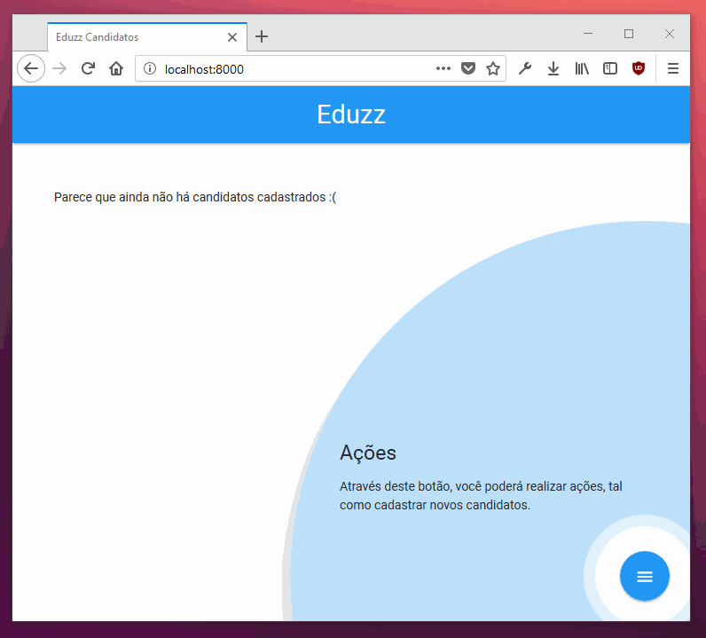
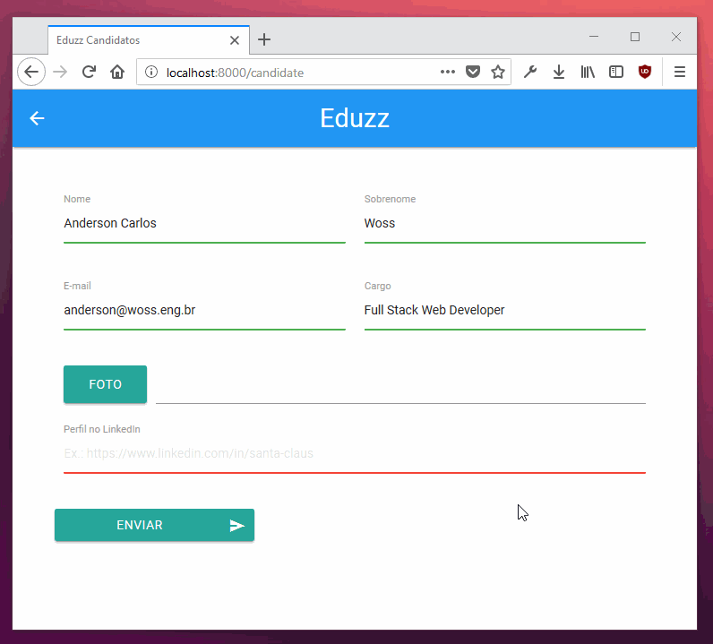
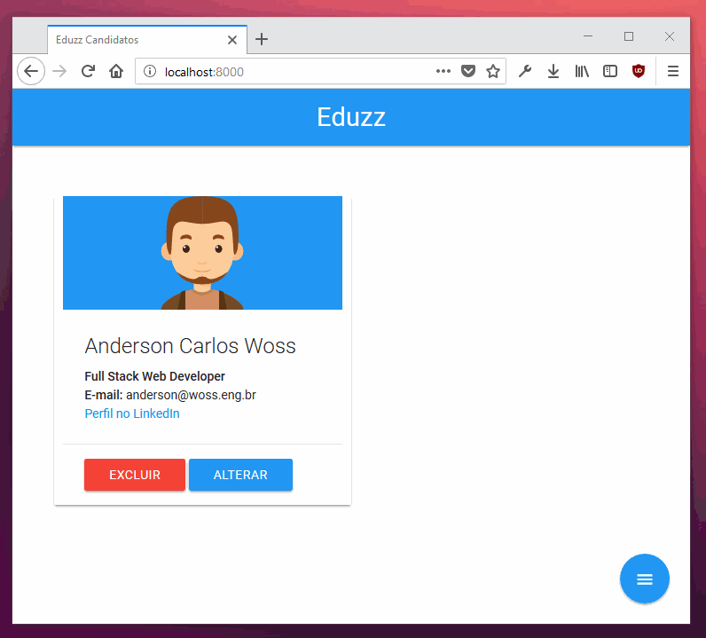

# eduzz-candidatos

Sistema CRUD desenvolvido como parte do processo seletivo da empresa Eduzz.

## Instalação

Primeiramente, é necessário clonar o repositório:

    git clone https://github.com/acwoss/eduzz-candidatos.git

Após, acessar a página do projeto

    cd eduzz-candidatos

E instalar todas as dependências:

    composer install

Para configurar o banco de dados, crie uma cópia do arquivo `.env.example` e altere as informações como necessário. Lembre-se também de criar a base de dados no servidor e certifique-se que os dados do usuário estão corretos. Feito isso, para inicializar o banco de dados da aplicação, execute:

    php artisan migrate

Se não ocorrer erros nestes passos, a aplicação está pronta para ser iniciada:

    php -S 0.0.0.0:8000 -t public

## Aplicação

Se estiver tudo funcionando, a aplicação se parecerá com:

## Como Utilizar

Saiba como utilizar o sistema.

### Cadastrando um novo candidato

1. Na página inicial da aplicação, quando não houverem candidatos cadastrados, uma mensagem de ajuda será exibida indicando como você pode cadastrar um novo candidato;

2. Pressione com o botão esquerdo do mouse sobre o botão para fechar a mensagem e mantenha sobre o mesmo para exibir as possíveis ações; por hora, somente a ação de cadastrar está disponível, então somente aparecerá o botão verde, pressione-o com o botão esquerdo do mouse. Ao fazer isso, você será redirecionado à página do formulário de cadastro;

3. Preencha o formulário com os dados do candidato. Lembre-se que algumas regras devem ser satisfeitas ao realizar este passo:

    - Todos os campos, excetuando-se a foto, são de preenchiumento obrigatório e podem conter no máximo 255 caracteres;
    - O campo de e-mail deve ser um e-mail válido e deve ser único na aplicação;
    - O campo do Perfil no LinkedIn deve ser uma URI válida;

4. Ao preencher devidamente todos os dados, pressione com o botão esquerdo do mouse sobre o botão Enviar. Se tudo ocorrer sem problemas, você será redicerionado de volta à página inicial e o novo candidato já deverá estar listado na aplicação.

### Alterando um candidato

1. Para alterar as informações de um candidato, localize-o na página inicial da aplicação e pressione o botão esquerdo do mouse sobre o botão Alterar, em azul.

2. Você será redirecionado para uma tela idêntica ao de cadastro de um novo candidato, porém, o formulário agora irá conter todos os dados do candidato que selecionou. Faça as alterações que desejar e pressione o botão Enviar para efetivá-las. Lembre-se que as mesmas regras do cadastro se aplicam na alteração dos dados.

3. Se tudo ocorrer bem, você será redirecionado de volta para a página inicial, onde os dados do candidato já estarão atualizados.

### Excluindo um candidato

1. De forma semelhante a alteração, para você excluir um candidato você primeiro terá que localizá-lo na página inicial da aplicação; feito isso, basta pressionar com o botão esquerdo do mouse sobre o botão Excluir, em vermelho.

2. Como, nesta versão do programa, a remoção de um candidato não poderá ser desfeita, uma mensagem de aviso será exibida na tela pedindo a sua confirmação. Se pressionar Ok, o candidato será excluído da base de dados, mas se cancelar a operação, o candidato permanecerá inalterado. Tome muito cuidado ao realizar a remoção de um registro.

3. Se tudo ocorrer bem, o candidato será removido da aplicação e não aparecerá mais nas listagens.

